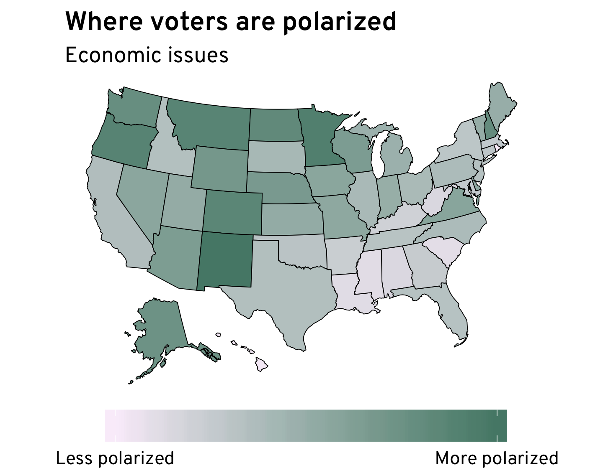
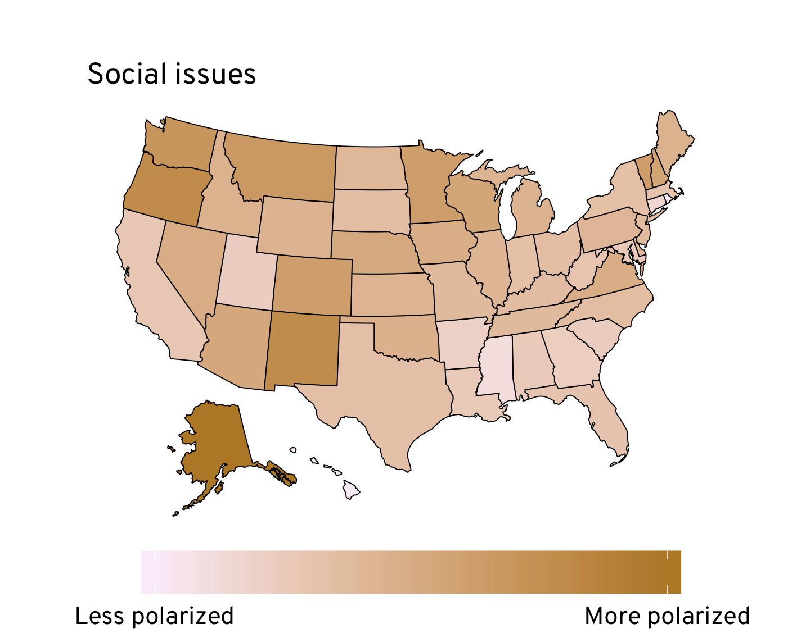

I recently examined the political views of ordinary
voters, and made a lot of comparisons across income groups, political
parties, education, and race.  One factor I didn't look at, though, was 
geography. While we&rsquo;re all familiar with the usual red-blue map of
state partisan preference, things get a little more interesting when we look
at states' views on economic and social issues separately.

<b><a href="/projects/electorate-2020/" target="_blank">
    Read: 
    Polarization and the American Electorate &raquo;
</a></b>

Using data from the [Cooperative Congressional Election Study](https://cces.gov.harvard.edu/),
which asks voters about their views on a range of policy questions, we can assign
each voter a social and economic score, ranging from &ndash;100 (most liberal)
to 100 (most conservative).  And then we can look at how these scores vary
across different states and groups.

An important point to preface things: in the interest of time, all the maps
here reflect raw scores, and some subgroups in some states have relatively small
sample sizes. Ideally, these scores would be input into a model which would 
use information in similar states to pool estimates and arrive at more robust
results.  So take everything here with a grain of salt.

First, we can look at how different states are politically polarized. Using the
standard deviation of voters' economic and social scores as a rough measure of
polarization, we end up with the maps below. Interestingly, polarization seems
to be higher in the West, and lowest in the South.  Particularly liberal or 
conservative states (like Hawaii or Mississippi) aren't very polarized, since 
much of the population is firmly in one political camp.  While Utah is moderately
polarized on economic issues, it is much less polarized on social issues, likely
due to its relatively high religious homogeneity.

<figure style="flex-direction: row; flex-wrap: wrap">

</figure>

The geographic distribution of social and economic scores themselves largely 
follows the usual partisan patterns, but there are subtle differences. These
stand out most when we compare states' economic and social scores to each other,
as in the map below. With few exceptions, states which lean Democratic are
generally more socially liberal than economically liberal, while states which
lean Republican are more economically than socially liberal. West Virginia has
the largest gap between the two scores---it is 12.6 points more economically
liberal than socially liberal.  On the other end of the scale, Connecticut is
9.2 points more socially than economically liberal.



The Rust Belt states that flipped from Obama to Trump in 2016 are each more
economically than socially liberal, something which may help to explain Trump's
success there. In contrast, states like Nevada and Virginia, which before the
election looked to be around as close as the Rust Belt (but were ultimately won
by Clinton) are more socially than economically liberal.

Previously, I had discussed how voters' income is an important predictor of
their economic and social views. How does income interact with these geographic
patterns? The maps below show the average economic scores for voters in each of
three income categories: <b>$</b>, less than $40,000 a year; <b>$$</b>, between
$40,000 and $150,000 a year; and <b>$$$</b>, more than $150,000 a year. For this
map and the next, it's especially important to keep in mind that some of the 
sample sizes for the higher-income group are small.



Across the country, there appears to be a liberal economic consensus among
lower-income voters, with little geographic variation. But among higher-income
voters, there is much more polarization: wealthy voters in coastal states are 
far more liberal, on average, than both their counterparts in Plains and
Southern states, and lower-income voters across the country. 

The social score pattern is broadly similar, but again, when compared to the
economic score within each state, some interesting patterns emerge.  The 
map below shows the balance of economic and social liberalism across income 
groups.



In general, lower-income voters are more economically than socially liberal,
while the opposite can be said of higher-income voters. And the pattern
of coastal states being more socially liberal is still present.  But among lower-
and middle-income voters, the pattern also holds across much of the Mountain 
West---while Nevada and Pennsylvania are both swing states, and have a similar
economic-social tilt among higher-income voters, Nevada's lower-income voters
are more socially liberal than economically liberal, while the opposite is true
for Pennsylvania's lower-income voters.

States, like individual voters, are more politically complex than the simple
liberal-conservative spectrum allows.  There can be important differences in the
level of polarization and the type of liberalism or conservatism across
otherwise similar states.
 
