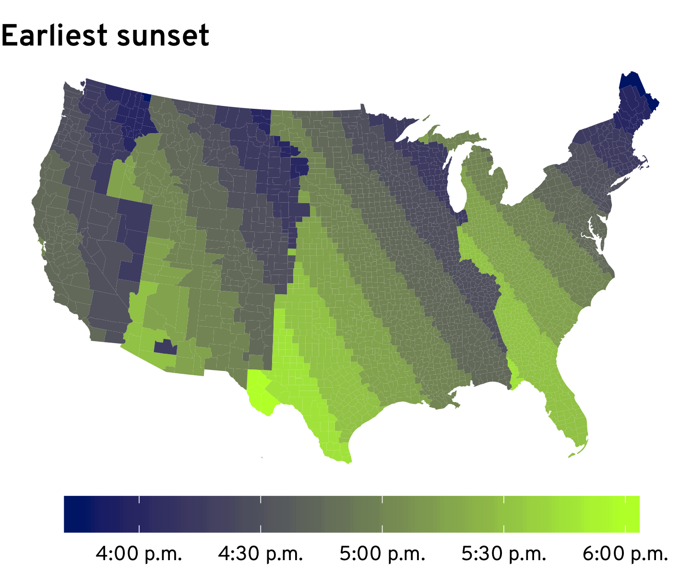
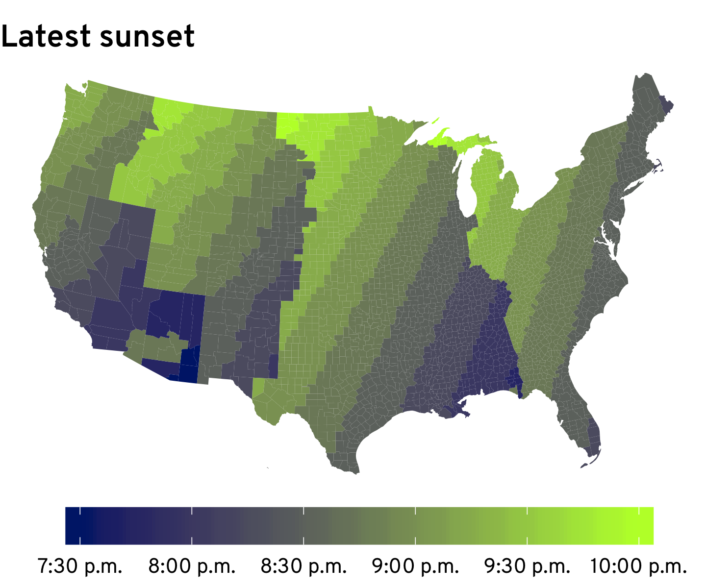
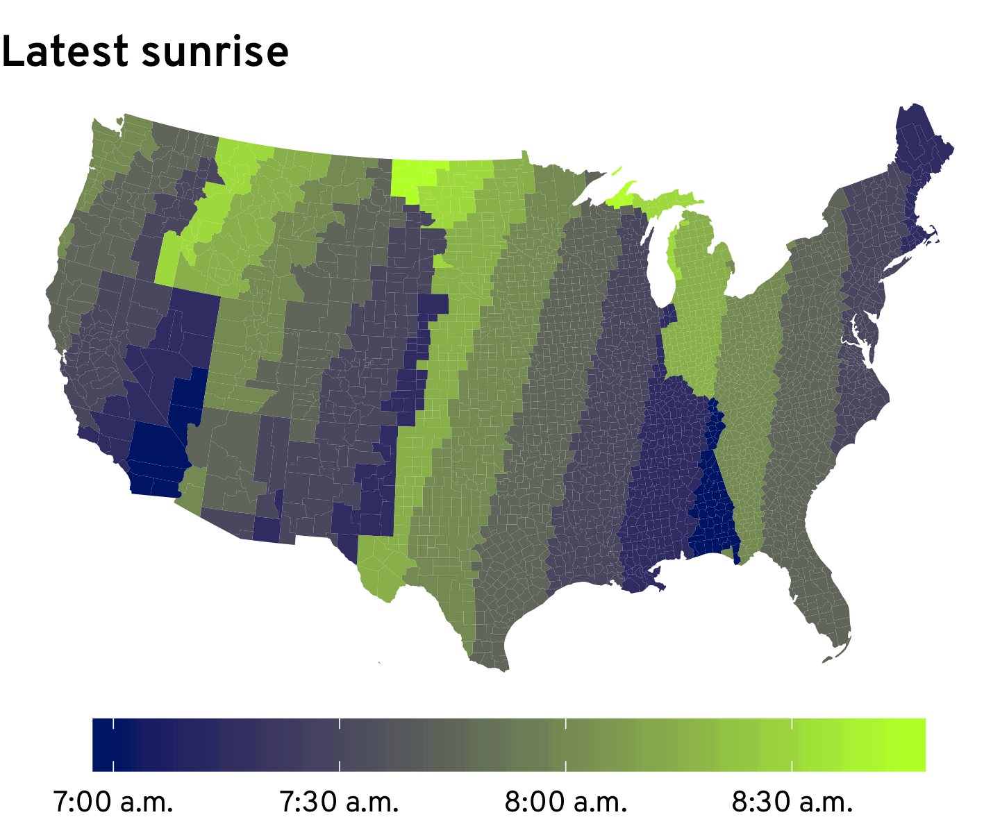
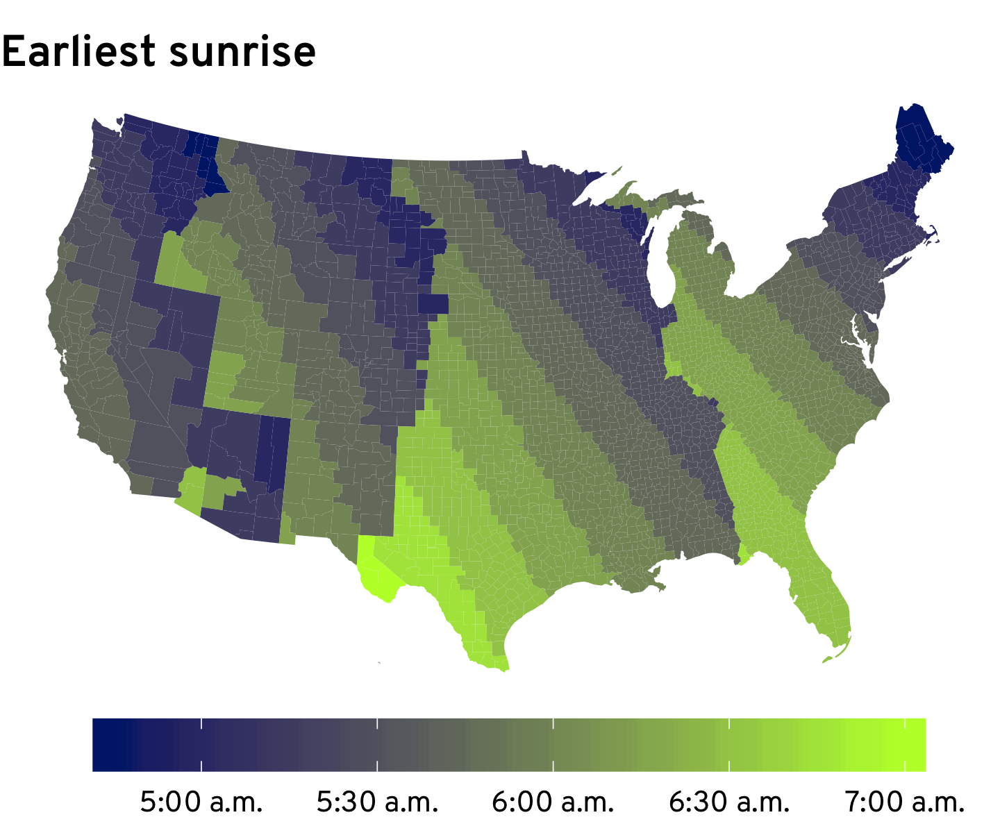
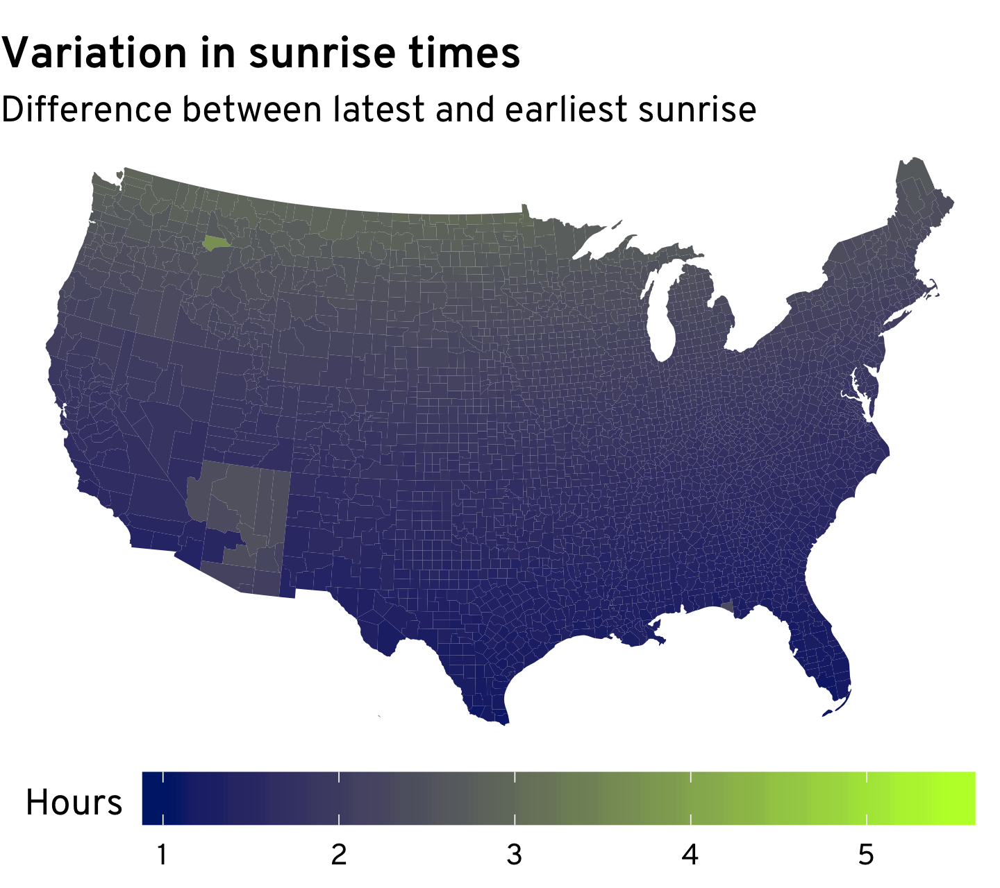
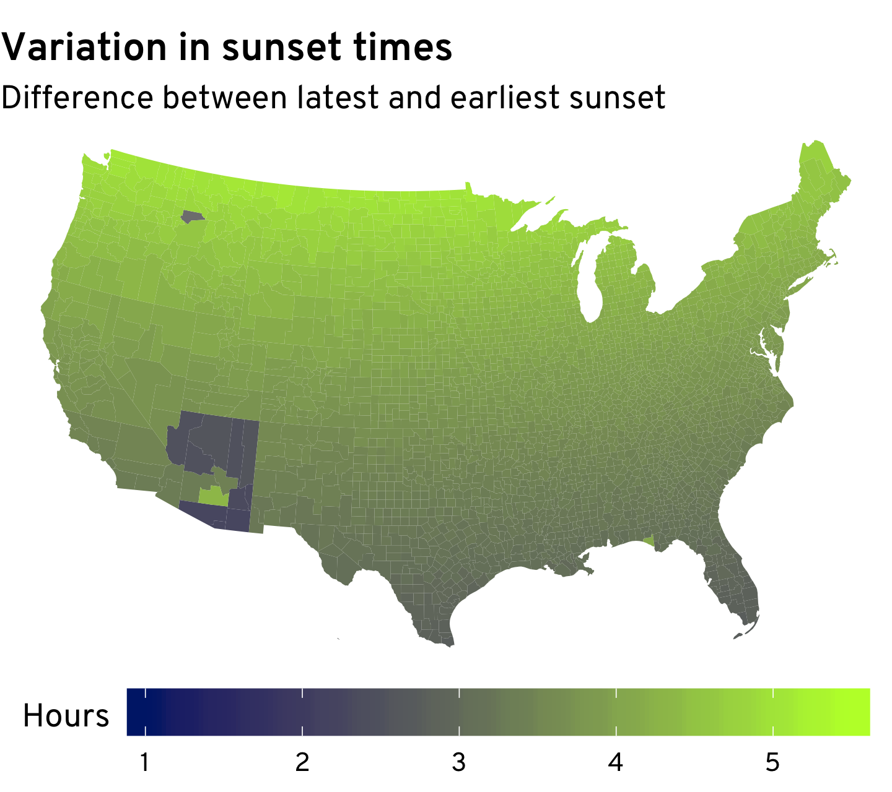
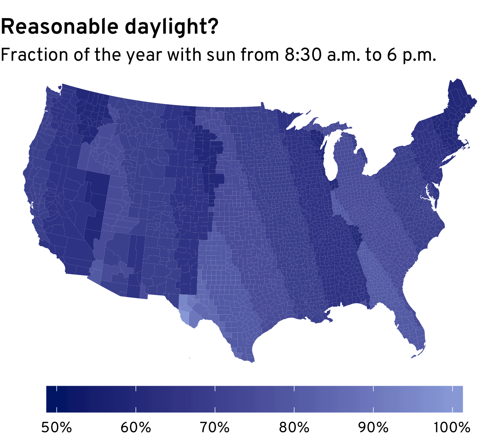
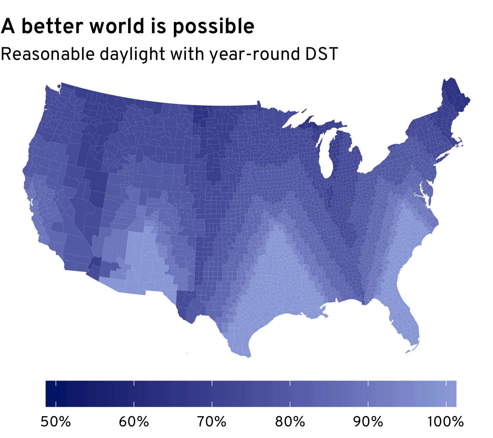



This morning, people across the country woke up a
little tired, robbed of an hour of sleep.  Our collective semiannual cycle
through the stages of Daylight Saving Grief is somewhere between anger and
bargaining. After the inevitable proposals that we abolish the practice
entirely, we'll slowly reach acceptance. Until November, that is.

Who knows? Maybe this really will be the last daylight savings change for many
of us.  [West Coast states](https://www.seattletimes.com/seattle-news/oregon-joins-washington-moves-toward-permanent-daylight-saving-time-2/)
and others have asked the federal government to allow them to stay on daylight 
time---with more light in the evening---the entire year.

The time zone shift is a good opportunity to study what daylight in the U.S.
looks like now, and what would it look like if we stayed on Daylight Saving
Time the whole year.

# Sun Stripes

These maps show the earliest and latest sunsets (across the year) around the
country under the current system. West Texas has the latest sunset in December,
while western North Dakota and the west part of Michigan's Upper Peninsula has
the latest sunset in June. (Alaska and Hawaii aren't shown, as their sunset and 
sunrise times can be very different from those in the lower forty-eight. There's 
also some strange artifacts in the Arizona data.)

<figure style="flex-direction: row; flex-wrap: wrap">

</figure>

The picture is broadly similar for sunrises. The latest December sunrises are in 
western North Dakota and the western part of the Upper Peninsula; the earliest
June sunrises are in West Texas.
<figure style="flex-direction: row; flex-wrap: wrap">

</figure>

Notice that for both sunrise and sunset times, the stripes run in different
directions for December and June. On the June solstice, Bismarck, North Dakota
and Mobile, Alabama both have their earliest sunrise at 5:45 a.m., but the 
sun sets at 8 p.m. in Mobile and 9:45 p.m. in Bismarck.

# Sunset Times are All Over the Place

What the four maps above obscure is the variation in sunrise and sunset times
*in a given place.* The effect of daylight saving time is to keep the sunrise
at about the same time in every place, while letting the sunset vary much more
widely.  The maps below show the variation in sunrise and sunset times---the
number of hours between the earliest and latest sunrises and sunsets, in
December and June---across the country. 

While places farther north experience more overall variation, it's very clear
that sunrises are much more consistent than sunsets. The only exception, of
course, is Arizona, which doesn't observe daylight savings. There, sunrise
and sunset vary by the same amount.

<figure style="flex-direction: row; flex-wrap: wrap">

</figure>

# Reasonable Daylight Hours

A side effect of the extreme variation in sunset times is that for much of the
year, the sun rises plenty early, but sets way too early. If we look at how many
days have "reasonable" daylight hours---the sun is up before 8:30 a.m. and stays
out until at least 6 p.m.---across the country, the results aren't fantastic 
(left map below). Except for the far reaches of West Texas, there's nowhere that
has 8:30--6 daylight every day. 

But if we were to switch to year-round DST (right map below), large chunks of
the country would be guaranteed reasonable daylight, and the siutation would
improve everywhere except northwest North Dakota. Thankfully, no one lives there.

<figure style="flex-direction: row; flex-wrap: wrap">

</figure>

The two maps above change a lot depending on how you define "reasonable" 
daylight hours, but the conclusion holds: unless you really care about early
morning sunlight, we'd all be better off with year-round DST!
