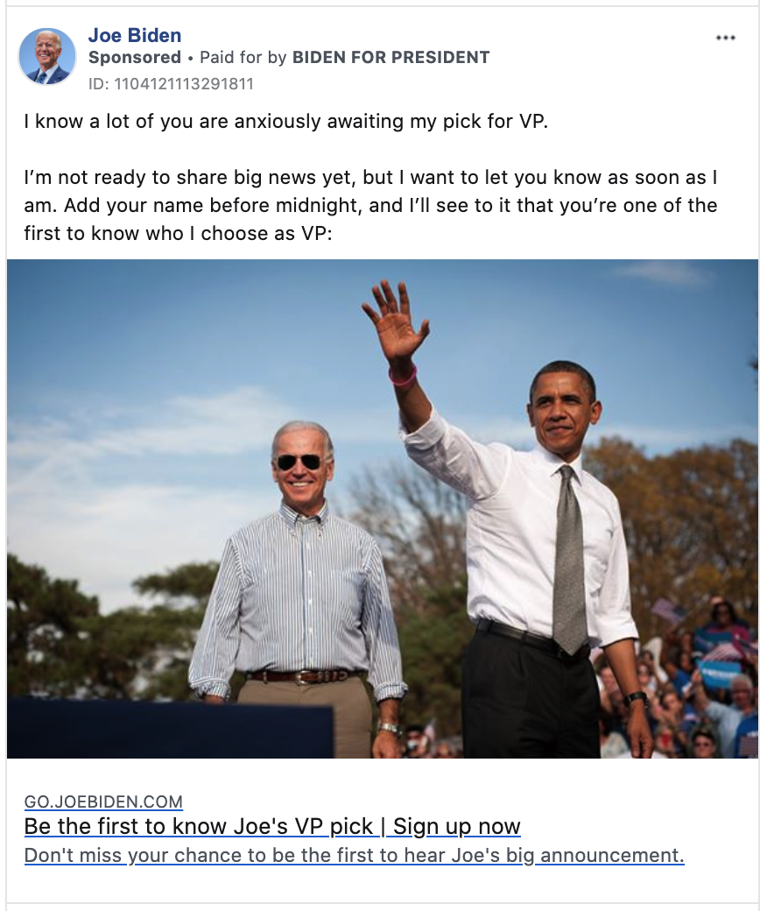

The race for president continues in these strange
times, albeit with one candidate stuck in his basement.  As the pandemic
unfolded around us, the focus of the race shifted from the primaries to the
general election, and while it&rsquo;s a long way to November, Joe Biden has
emerged as the polling leader and a [moderate favorite to win the election,
according to this site&rsquo;s forecast](/projects/president-20/).

There's been some [discussion of Biden's fundraising gap with Donald
Trump](https://www.wsj.com/articles/before-coronavirushit-joe-biden-raked-in-campaign-cash-in-march-11587461403),
and what it might mean for his prospects.  But money means little unless it is 
put to good use, and so it is worth examining how the candidates spend their
fundraising hauls.

One of the biggest uses of campaign funds, obviously, is advertising; digital
advertising in particular has become central to campaigns' strategy, in no small
part because digital ads can be targeted to voters in certain demographics or
states.

Following the advertising and targeting disaster that was the 2016 election,
Facebook and other digital publishers have published much more data about the 
ads running on their platforms---the ad content, who buys them (and for how much), 
and who sees them, across regions and demographics.  

So what is the state of digital campaign advertising in early May? Last week,
Biden outspent Trump on Facebook by more than a 2-to-1 margin, paying nearly
$250,000 to put ads in front of 13.1 million viewers.



Now, one might expect (as I did) that Biden and Trump would be concentrating
their ad purchases in states that are likely to swing the election.  Since
California and Wyoming are virtually guaranteed to go to Biden and Trump,
respectively, there's little value in changing voters' minds in these states.

We can quantify this intuition by comparing ad spending by state (on a
per-capita basis) to the relative power of voters in that state---[how likely
an individual voter is to decide the election](/projects/president-20/#state-forecasts), 
compared to the average voter nationally.  Voters in small swing states have
the most relative power, while voters in places like California and New York
have essentially zero relative power. We use per-capita figures to avoid these
patterns getting swamped by differences in population; after all, we'd expect
candidates to spend more in big states---there are more voters there to
convince!



But as the chart above shows, there's zero correlation between voters' power
and how much the campaigns are spending per state. The cluster of states at the
left of the graph, whose electoral outcomes are all-but-determined, still saw
as many or more digital ads than the more competitive states at the right of
the graph.

In contrast, there's a strong association between ad spending by state and the 
[expected vote share in that state](/projects/president-20/#state-forecasts)---Biden 
is spending most heavily in Democratic strongholds like D.C., California, and
Massachusetts, while Trump's biggest spending is in deep red states like
Wyoming and West Virginia.



What's going on? A look at the actual ads the campaigns are running clears
things up.  The images below show the active ads for each campaign that have
been shown to the most voters; both are clearly designed to mobilize their
bases or fundraise. 

So it seems the campaigns have decided to build their war chests in the short
term and worry about persuading voters later.  I plan on adding ad data to the 
[presidential forecast](/projects/president-20/) so that it's easy to track
how the campaigns' strategies align with the dynamics of the electoral college.

<figure style="flex-direction: row; flex-wrap: wrap; align-items: flex-start;">

</figure>
